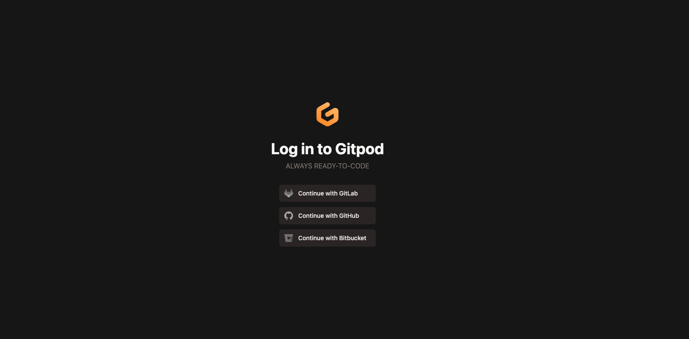
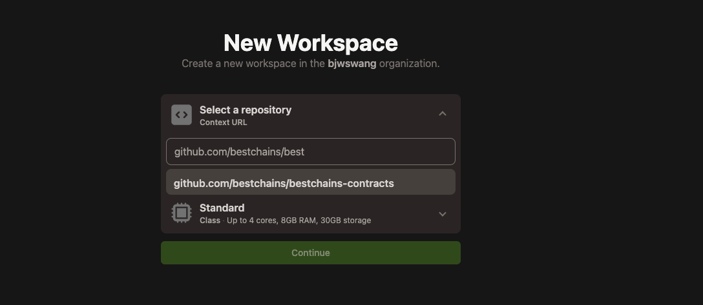

Bestchains平台目前仅支持[Hyperledger Fabric Chaincode Golang 合约](https://hyperledger-fabric.readthedocs.io/en/latest/sdk_chaincode.html)。因此，开发人员需要具备:

- Chaincode 合约开发能力
- Go 语言开发能力

Bestchains 提供[智能合约开发库](https://github.com/bestchains/bestchains-contracts)，开发者可以参考[示例](https://github.com/bestchains/bestchains-contracts/tree/main/examples)实现。下面，介绍如何使用 Bestchains 平台完成合约的开发及测试：

## 预先准备

### 开发环境

#### 本地开发环境

1. 准备开发环境

- [Go 1.20](https://go.dev/)
- IDE: [VSCode](https://code.visualstudio.com/) （推荐）/ [GoLand](https://www.jetbrains.com/go)

2. 克隆代码库

```shell
git clone https://github.com/bestchains/bestchains-contracts.git
```

#### Gitpod在线开发

1. 手动打开[`Gitpod`官网](https://gitpod.io/)



> 任意选择一种登录方式，推荐Github登录

2. 创建Workspace


3. 配置repository



:::tip
  推荐先fork `bestchains/bestchains-contracts`仓库，然后再gitpod中使用fork仓库开发
:::

### 准备一个区块链测试网络

通过Bestchains平台创建如下最小配置的网络:

- 网络共识集群设置为 1 个节点，采用默认资源配置
- 通道仅包含 1 个拥有 1 名用户的组织
- 通道仅 1 个组织节点加入

## 开发教程

> 以[nonce合约](https://github.com/bestchains/bestchains-contracts/tree/main/examples/nonce)为例

### 1. 定义合约接口

**contracts/nonce/interfaces.go**

如下所示:

> [https://github.com/bestchains/bestchains-contracts/blob/main/contracts/nonce/interfaces.](https://github.com/bestchains/bestchains-contracts/blob/main/contracts/nonce/interfaces.go)

```go
import "github.com/bestchains/bestchains-contracts/library/context"


type INonce interface {
    Check(context.ContextInterface, string, uint64) error
    Current(context.ContextInterface, string) (uint64, error)
    Increment(context.ContextInterface, string) (uint64, error)
}
```

Nonce合约定义了三个接口，分别为:

- Check ：校验账户对应的 nonce 值是否正确
- Current : 查询账户当前的 nonce 值
- Increment : 账户当前 nonce++

合约函数中，第一个参数永远为 [Context](https://github.com/bestchains/bestchains-contracts/blob/main/library/context/context.go#L45)，用于获取当前交易请求的上下文以及获取状态数据库最新状态。为了方便使用，在官方 [context](https://github.com/hyperledger/fabric-contract-api-go/blob/main/contractapi/transaction_context.go#L15) 基础上扩展了对二级交易发送者 (etheruem account) 的支持。

### 2. 实现合约接口

**contracts/nonce/nonce.go**

> https://github.com/bestchains/bestchains-contracts/blob/main/contracts/nonce/nonce.go

以接口 Increment 为例:

- Increment

```go
const (
    NoncePrefix = "nonce~account"
)
func (nonce *Nonce) Increment(ctx context.ContextInterface, account string) (uint64, error) {
    nonceKey, err := ctx.GetStub().CreateCompositeKey(NoncePrefix, []string{account})
    if err != nil {
        return 0, err
        }
        val, err := ctx.GetStub().GetState(nonceKey)
        if err != nil {
            return 0, err
        }
        counter, err := library.BytesToCounter(val)
        if err != nil {
            return 0, err
        }
        counter.Increment()

        err = ctx.GetStub().PutState(nonceKey, counter.Bytes())
        if err != nil {
             return 0, err
        }
        return counter.Current(), nil
    }
```

通过 ``CreateCompositeKey`` 构建组合 ``key``，然后通过 ``GetState`` 向状态数据库查询当前最新的 ``nonce`` 值，令其自增后通过 ``PutState`` 更新到状态数据库中。所有需要持续存储的数据均需以上述方式对状态数据库中存取。

#### 2.1 定义事件（Event）

在一些应用场景中，我们希望调用合约接口的操作或结果能够广播告知同一通道上的其他用户、应用或接口，例如完成一笔交易、一次声明等。此时便可以在合约接口实现中通过 ``EmitEvent`` 生成一个**事件**。以 ``ERC-20`` 合约为例：

```go
func _transfer(ctx context.ContextInterface, from string, to string, amount uint64) error {
    var err error
    toAddr := library.Address(to)
    fromAddr := library.Address(from)

    // validate address

    // beforeTokenTransfer

    senderBalanceKey, err := ctx.GetStub().CreateCompositeKey(BalancePrefix, []string{from})
    if err != nil {
        return err
    }
    receiverBalanceKey, err := ctx.GetStub().CreateCompositeKey(BalancePrefix, []string{to})
    if err != nil {
        return err
    }

        senderBalanceVal, err := ctx.GetStub().GetState(senderBalanceKey)
        if err != nil {
            return err
    }
    receiverBalanceVal, err := ctx.GetStub().GetState(receiverBalanceKey)
    if err != nil {
        return err
    }

    senderBalance, err := library.BytesToUint64(senderBalanceVal)
    if err != nil {
        return err
    }
    receiverBalance, err := library.BytesToUint64(receiverBalanceVal)
    if err != nil {
        return err
    }

    if senderBalance < amount {
        return fmt.Errorf("transferred more than it has")
    }

    err = ctx.GetStub().PutState(senderBalanceKey, []byte(library.Uint64ToString(amount+receiverBalance)))
    if err != nil {
        return err
    }

    err = ctx.GetStub().PutState(receiverBalanceKey, []byte(library.Uint64ToString(senderBalance-amount)))
    if err != nil {
        return err
    }

    if err = ctx.EmitEvent("Transfer", &EventTransfer{
        Operator: ctx.MsgSender(),
        From:     fromAddr,
        To:       toAddr,
        Value:    amount,
    }); err != nil {
        return errors.Wrap(err, "Event Transfer")
    }

    // afterTokenTransfer

    return nil
}
```

 ``_transfer`` 函数实现了交易接口功能，将指定数量的 token 从 from 地址移交至 to 地址。依据 ``ERC-20`` 合约的要求，该函数生成一个 ``Transfer`` 事件，内容包括交易的操作者、发送方、接收方、交易量。当一笔交易发生后，通道中监听该类事件的应用便会得到事件的通知。

### 3. 编写入口函数

**examples/nonce/main.go**

如下所示:

> https://github.com/bestchains/bestchains-contracts/blob/main/examples/nonce/main.go

```go
package main
    
    import (
        "github.com/bestchains/bestchains-contracts/contracts/nonce"
        "github.com/bestchains/bestchains-contracts/library/context"
        "github.com/hyperledger/fabric-contract-api-go/contractapi"
    )
    
    func main() {
        nonceContract := new(nonce.Nonce)
        nonceContract.Name = "org.bestchains.com.NonceContract"
        nonceContract.TransactionContextHandler = new(context.Context)
        nonceContract.BeforeTransaction = context.BeforeTransaction
    
        cc, err := contractapi.NewChaincode(nonceContract)
        if err != nil {
            panic(err.Error())
        }
    
        if err := cc.Start(); err != nil {
            panic(err.Error())
        }
    }
```

- 初始化合约实例

```go
    nonceContract := new(nonce.Nonce)
```

- 设置 **TransactionContextHandler** 为扩展 **context**

```go
    nonceContract.TransactionContextHandler = new(context.Context)
```

- 设置 **BeforeTransaction** 为扩展 Context

```go
    nonceContract.BeforeTransaction = context.BeforeTransaction
```

- 初始化 Chaincode

```go
    cc, err := contractapi.NewChaincode(nonceContract)
```

### 4. 安装部署

> 参考**快速使用**： [QuickStart/usage](https://github.com/bestchains/website/blob/main/docs/QuickStart/usage.md)

### 5. 合约方法测试

> 参考:  [bestchains/bc-explorer/cmd/client](https://github.com/bestchains/bc-explorer#client)

#### 5.1 查询合约 Metadata

```shell
./client -profile network.json -contract nonce -method org.hyperledger.fabric:GetMetadata
```

> NOTE: 如果合约部署正常，此处将返回合约内定义的方法、参数等信息

#### 5.2 通过 Client CLI 构造交易

- 查询账户 0xacccount 当前的 nonce 值

```shell
./client -profile network.json -contract nonce -method Current -args 0xaccount
```

- 增加账户 0xaccount 的 nonce

```shell
./client -profile network.json -contract nonce -method Increment -args 0xaccount
```

### 6. 校验合约执行结果

> 通过 Bestchains 平台的区块链浏览器，查看对应网络的交易详情
