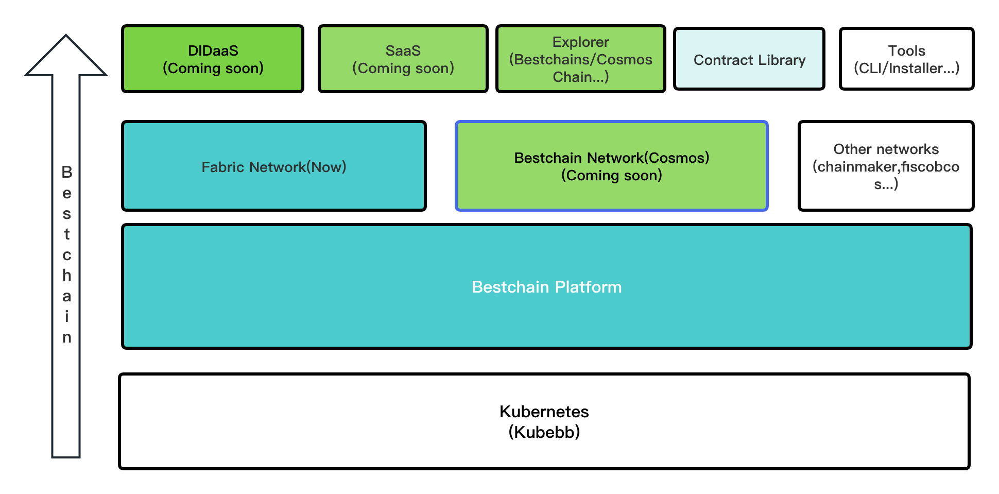

Bestchain 是完全开源、全栈式的Web3解决方案。

### Layer1基础设施层

通过[Kubebb](https://github.com/kubebb)部署和管理基础设施，包括:

- [Kubernetes](https://kubernetes.io/)，容器编排平台
- [U4A组件](https://github.com/kubebb/building-base)，提供身份认证授权、访问控制
- [Nginx Ingress](https://docs.nginx.com/nginx-ingress-controller/)组件，提供外部访问平台内部服务的负载均衡、SSL加密等能力
- Addons扩展组件，如：
  - [Kubernetes Dashboard](https://github.com/kubernetes/dashboard)
  - [kubelogin](https://github.com/int128/kubelogin)

### Layer2区块链平台层

提供平台化的区块链管理能力，包括:

- 组织管理
- 联盟管理
- 网络管理
- 通道管理
- 合约管理

以及相应的：

- 内部区块链浏览器
- 实时日志
- 监控

等能力

### Layer3底层区块链网络

底层区块链网络是整个Web3解决方案的核心，目前底层区块链技术大致可分为两类：

- 联盟链: 链的使用限制在联盟内部，属于半去中心化的区块链网络
- 公链: 链的使用完全开放，属于完全去中心化的区块链网络

从用户使用群体的角度，我们首先接入了超级账本下的[Fabric](https://github.com/hyperledger/fabric)底层区块链,提供完整的联盟链管理、应用研发、网络监控等完整的解决方案。

#### Bestchains网络

我们同样认为，**公链技术**同样的不可或缺，尤其是当联盟链网络发展到一定程度，一定会带来**用户群体受限、数据孤岛、场景受限**等问题。这个时候，我们可以借助**公链技术**，从而:

- 构建更加开放、健全的生态
- 为联盟链和其他公链提供一个通用的**中继链跨链**方案

### Layer4解决方案层

围绕区块链网络，我们准备从以下几个方向入手：

#### 1. SaaS软件及服务

基于BESTCHAIN平台能力，赋能传统、新兴的应用场景。目前，我们考虑从两个方向入手:

- [Depository as a Service(存证即服务)](https://github.com/bestchains/bc-saas/tree/main/cmd/depository)

优化通用的去中心化数字存证服务，强化数字存证的防篡改、可追溯、数据来源可信等能力

- NFT as a Service(数藏即服务)(**Not Implemented Yet**)

提供简捷、全面的数字藏品服务，降低普通商户接入数字藏品门槛

#### 2. Explorer开放区块链浏览器(**Not Implemented Yet**)

以可视化的方式开放区块链网络数据，同时支持BESTCHAINS平台内部和平台外部的区块链网络，并且支持多种异构链

- Fabric
- Cosmos生态链
- Ethereum生态链

#### 3. DIDaaS(Not Planned Yet)

基于BESTCHAIN平台能力，实现一套DID(去中心化数字身份)解决方案，并以DIDaaS的形式提供去中心化数字身份的：

- 身份管理
- 身份认证
- 授权
- 访问控制

并广泛应用到我们其他的SaaS服务中，甚至考虑与云原生平台结合，优化云原生平台的管理机制，使其权限管理上更加公平透明。

#### 4. Contract Library

- [bestchains-contract](https://github.com/bestchains/bestchains-contracts):提供合约开发仓库，目前主要支持Fabric Chaincode

#### 5. Tools

目前，主要考虑提供:

- [installer](https://github.com/bestchains/installer): 提供平台组件快速部署
- [CLI](https://github.com/bestchains/bc-cli): 提供适合开发人员的命令行工具
