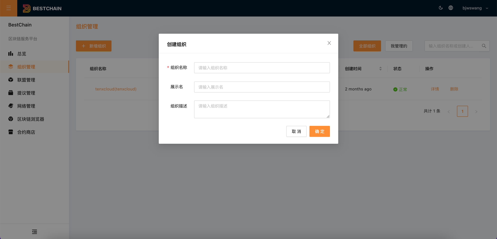
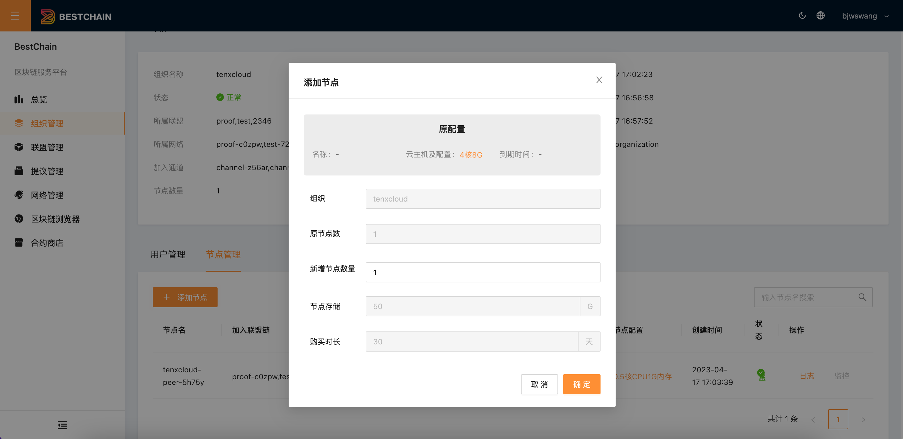
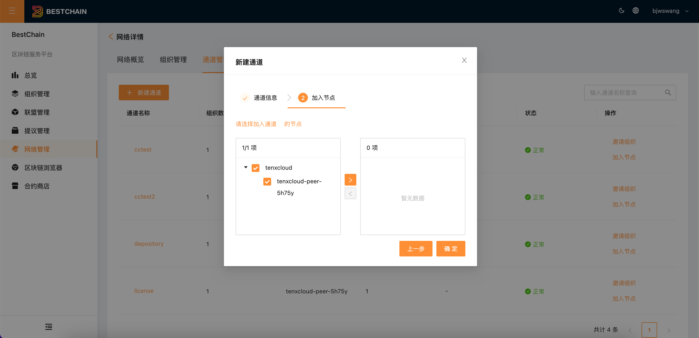
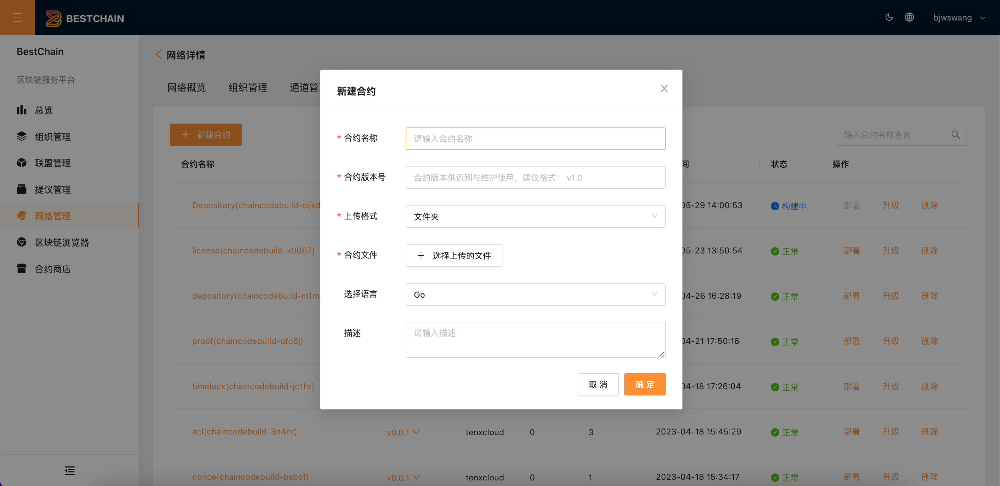
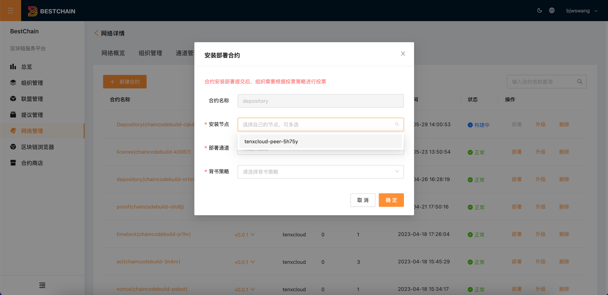

您可通过以下步骤快速开始使用**BestChains**区块链服务平台搭建自己的区块链网络。

## 前置条件

登录**BestChains**区块链服务平台。

:::tip
如无账号，需要向**平台管理员**申请注册账号。
:::tip

## 使用步骤

### 步骤一：创建组织

1. 单击左侧导航栏中的**组织管理**，进入组织列表页面。并单击**新增组织**。

2. 在弹出的**新增组织**窗口中，参考以下信息进行填写，并单击**确定**即可创建组织。如下图所示：

参数说明：

* **组织名称**：组织的名称，字符长度为 3～20，由小写字母、数字、下划线组成，开头和结尾只能是字母或数字。
* **展示名（选填）：**有0～20个中英文、数字组成。
* **组织描述（选填）**：100字符以内。

:::tip
组织创建成功之后，选择左侧导航栏中的组织管理，在**组织**列表页面查看组织信息。可以邀请别的用户加入组织，参考「**组织新增成员**」。
:::

3. 点击**详情**进入组织详情页面，单击**添加节点**可添加节点资源。如下图所示：

### 步骤二：创建联盟

1. 单击左侧导航栏中的**联盟**，进入联盟列表页面。

2. 点击**新建联盟，**在弹出的**新建联盟**窗口中，参考以下信息进行填写，并单击**确定**即可创建联盟。如下图所示：

参数说明：

* **联盟名称**：联盟的名称，字符长度为 3～20，由小写字母、数字、下划线组成，开头和结尾只能是字母或数字。
* **发起者：**创建联盟必须要选择**步骤一 新建的组织**作为发起者（如果没有组织，可以参看**步骤一「新建组织」**）
* **选择成员（选填）**：创建联盟时可选择平台其他组织作为初始成员（需经对方接受邀请），也可不选择成员，联盟创建之后再进行邀请组织加入。
* **提议投票策略：**选择联盟投票策略，联盟下网络将继承该策略
  * **All**：所有组织同意(**推荐**)
  * **Majority**：大部分组织同意
  * **OneVote**：任一组织同意

* **联盟描述：**100 字符以内。

3. 新建联盟参数填写提交之后，点击确定.

:::tip
若未邀请其他成员，无需经过发起提议投票，联盟创建成功。

若邀请了其他成员成员，需要其他成员在**提议管理**中进行投票（参见**用户指南**中**提议管理**），所有成员投票之后，联盟创建成功。
:::

4. 成功创建联盟后，选择左侧导航栏中的联盟管理，在**联盟**列表页面查看联盟信息。

### 步骤三：创建网络

1. 在联盟管理页面中点击创建成功的**联盟名称**或者**详情，**进入**联盟详情**页，点击**新建网络**。如下图所示：

:::tip
也可以选择左侧导航栏中的**网络**，进入**网络**列表页面，点击**新建网络**。
:::

参数说明：

* **网络名称**：网络的名称，字符长度为 3～20，由小写字母、数字、下划线组成，开头和结尾只能是字母或数字。
* **所属联盟：**选择新创建的联盟或者自己已加入的联盟。如没有联盟，参照 **步骤二 「新建联盟」。**
* **发起者：**创建网络必须要选择一个组织作为发起者，如果没有组织，可以参看**步骤一「新建组织**」。
* **共识集群节点：**最小值 1，最大值 5，超过 5 时提示。
* **网络描述：**100 字符以内。

2、成功组建区块链网络后，选择左侧导航栏中的网络管理，在**网络**列表页面查看网络信息。

### 步骤四：创建通道

1、在**网络详情**页面，选择**通道管理**页签，并单击**新建**。

2、在弹出的**新建通道**窗口中，参考以下信息进行填写。

2.1、 完成基础信息填写（参数参照创建网络）

* 必选: 设置发起组织（如该网络有用户多个组织）
* 可选: 配置成员，邀请**网络中**的其他用户组织加入通道

如下图所示：

完成基础信息之后，点击**下一步**，

2.2 选择自己组织以及组织下的节点（如组织没有节点，参照**步骤一**中**添加节点**）加入通道，完成之后点击**完成**

3. 成功创建通道后，选择**网络详情**的**通道管理**，在“**通道管理**”列表页面查看通道信息。

### 步骤五：安装部署合约

#### 新建合约

1. 在**网络详情**页面，选择**合约管理**页签，并单击**新建**。

2. 在弹出的“新建合约”窗口中，参考以下信息进行填写，选择上传格式（目前支持文件夹和 zip 压缩包），并上传相应的合约文件。

:::tip
平台提供了一些模板，可以直接使用，点击[此处](https://github.com/bestchains/bestchains-contracts)。默认构建的合约为[`BasicContract`](https://github.com/bestchains/bestchains-contracts/blob/main/contracts.json#L3)
:::

如下图所示:

3. 成功新建合约后，选择**网络详情**的**合约管理**，在“**合约管理**”列表页面查看合约信息

:::tip
当合约状态变为**正常**可进行下一步 **安装部署合约**
:::

#### 创建背书策略

在**网络详情**页面，选择**背书策略**页签，并单击**新建**。

#### 安装部署合约

1. 在**网络详情**页面，选择**合约管理**页签，合约列表页面，可以选择相应合约，点击**部署**。

2. 在弹出的**合约安装部署**窗口中，选择合约安装的**节点**和部署的**通道**，也可选择设置相关的**背书策略**。（参见用户指南**背书策略**）如下图所示：

:::tip
点击确定，即可发起合约安装部署的提议. 提议发起成功后，可在**提议管理**中查看提议状态。如果通道所在联盟中仅一个组织，提议自动通过，合约自动安装；如果通道所在联盟中有多个组织，需要其他组织在**提议管理**中进行投票，所有组织投票通过后，合约自动安装。
:::

3. 安装部署合约成功后，可通过智能合约发起交易上链。发起交易后，可在**区块链浏览器**来查询交易和区块。
