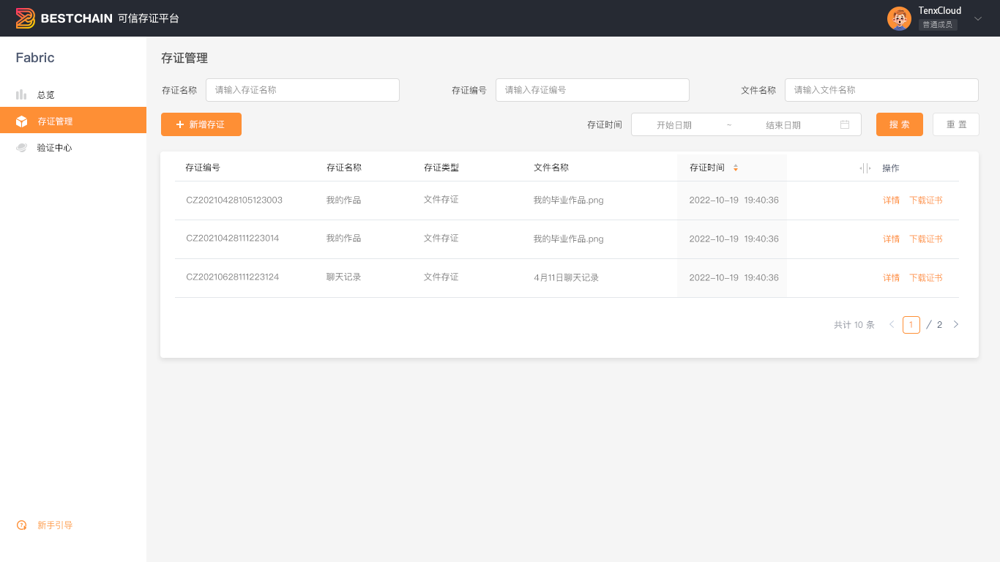

## 前置条件

登录**BestChains**区块链服务平台。

:::tip
如无账号，需要向**平台管理员**申请注册账号。
:::tip

## 用户指南

### 查看存证平台总览

进入存证服务后，默认展示**总览**,如下图所示:

关键内容:

1. 用户当前的总存证余量
2. 用户已存证的数量

### 存证管理

用于展示存证平台所有的存证列表信息，支持通过**存证名称/存证编号/文件名称**快速检索

### 新增存证

用于新增一个区块链存证，目前仅支持**文件存证**

### 验证存证

用于完成存证内容的验证，需提供:

- 存证编号
- 存证针对的原始文件

