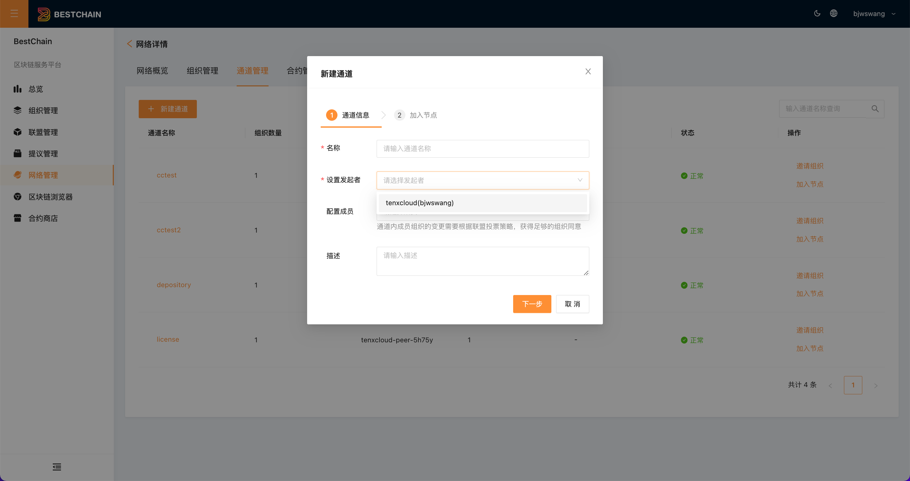
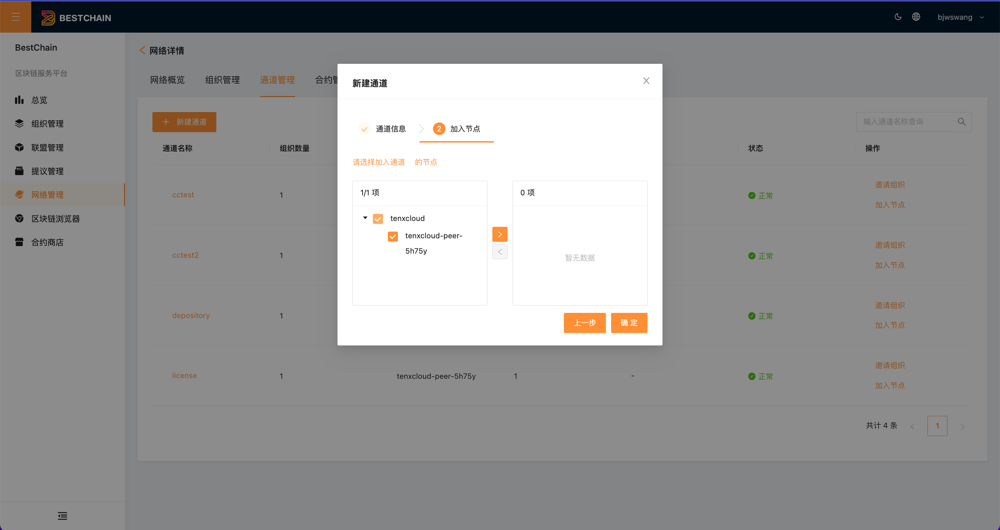
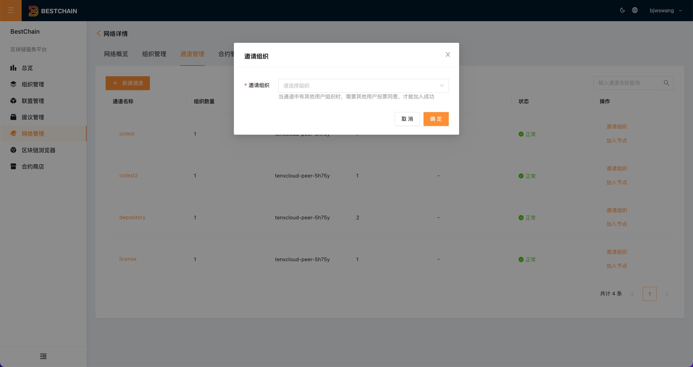
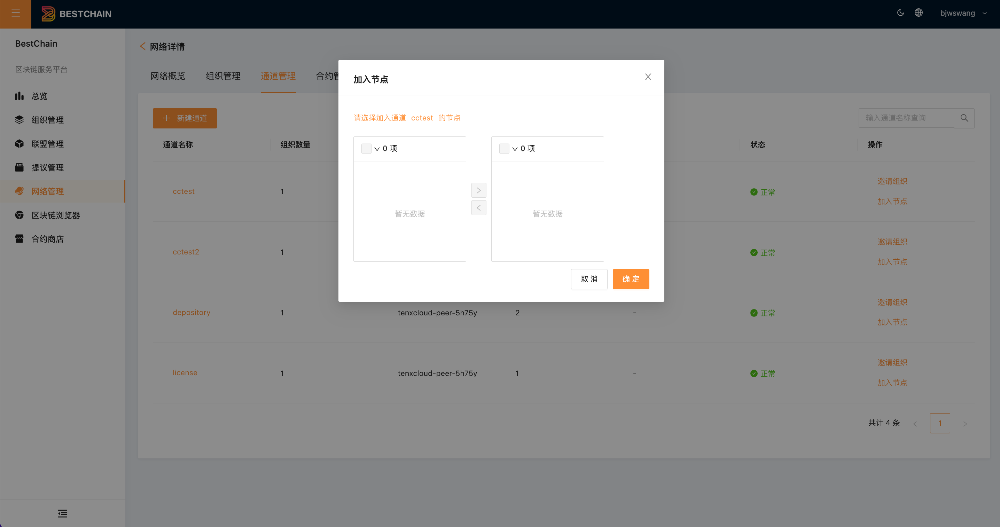

:::tip
通道管理位于网络详情内部，属于链管理的一部分
:::

## 通道列表

点击**通道管理**，查看网络下的当前通道列表。如下图所示：

## 新建通道

点击**新建通道**，进入通道创建页面。 通道创建分为两步:

1. 填写通道信息

2. 选择节点加入

## 查看通道详情

点击通道名称，进入通道详情页面。如下图所示：

## 邀请组织

通道创建后，如果想要邀请其他组织加入通道，可以点击**邀请组织**，进入邀请组织页面。如下图所示：

:::tip
邀请组织只能邀请当前网络下的组织加入通道
:::

## 节点加入

通道创建后，如果想要邀请其他节点加入通道，可以点击**节点加入**，进入节点加入页面。如下图所示：

