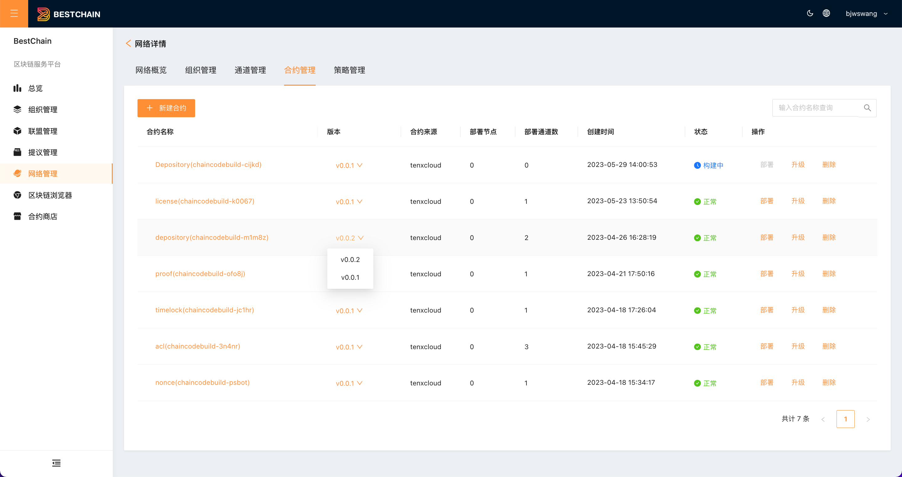
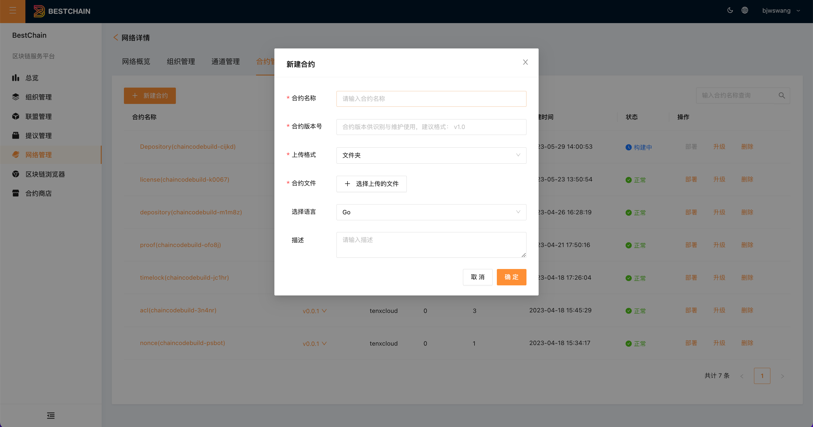
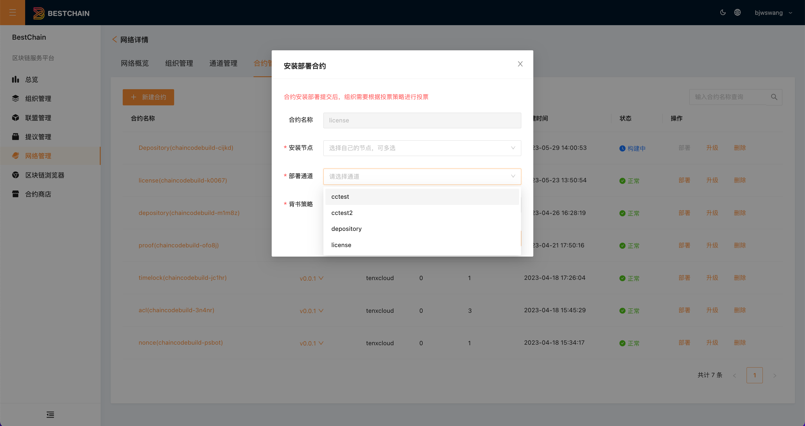
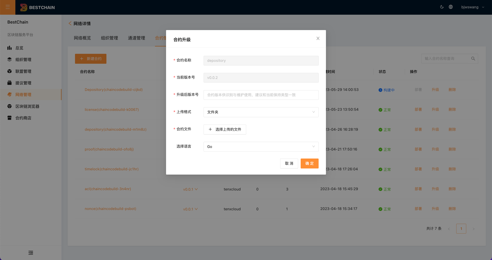
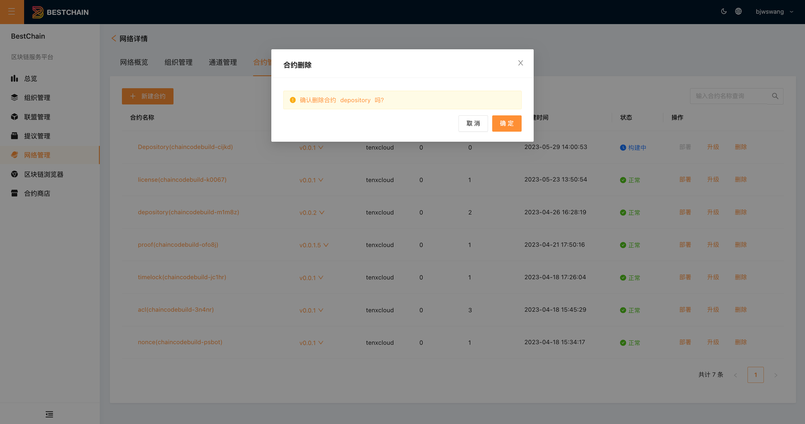

:::tip
智能合约管理位于网络详情内部，属于链管理的一部分。此处的智能合约为合约代码管理。Bestchain平台集成了[fabric-builder-k8s](https://github.com/bestchains/fabric-builder-k8s)。用户上传的合约代码将通过[Tekton CI](https://tekton.dev/)自动构建成镜像。
:::

## 查看合约列表

点击网络的**智能合约**，查看网络下的当前合约列表。如下图所示：

1. 合约状态包含两种:

- **构建中**:代表合约代码正在构建镜像
- **正常**:代表合约代码构建镜像成功

2. 点击版本号，可查看合约目前的版本列表

## 新建合约

点击**新建合约**，进入合约创建页面,如下图所示：

1. 合约文件支持两种类型:

- 文件夹
- 压缩包(目前仅支持zip)

2. 合约语言目前仅支持**Go**

## 部署合约

合约构建完成后，可部署到通道中。点击**部署合约**，进入合约部署页面。如下图所示：

:::tip
选择不同的版本，部署到同一个通道，即为实现合约在**通道内的升级**
:::

部署过程中，需要填写:

- 部署的目标通道
- 部署的合约背书策略
- 部署的通道节点(多选)

## 升级合约

开发者开发新版本的合约后，可通过此功能上传新的版本,如下图所示：

:::tip
此处的升级合约仅为合约代码仓库里的合约版本升级，不会触发合约在通道内的升级
:::

## 删除合约

:::tip
合约删除为针对合约某个版本的删除。如果该版本的合约已经部署到通道中，将无法删除
:::

