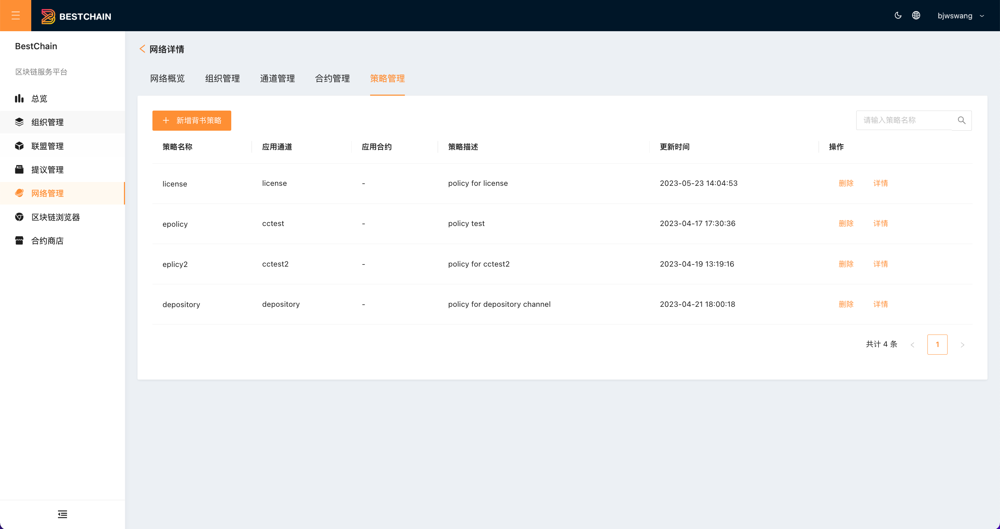
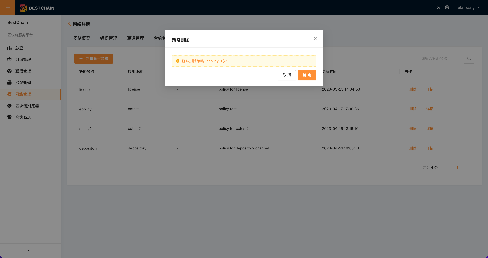

审计策略为链管理的一部分，位于网络详情内部。审计策略(`Endorse Policy`)为区块链中用于验证合约交易合法性的一个关键性配置。详情可参考[官方定义](https://hyperledger-fabric.readthedocs.io/en/release-2.5/endorsement-policies.html?highlight=endorse%20policy)

## 审计策略列表

点击网络的**审计策略**，查看网络下的当前审计策略列表。如下图所示：

## 新建审计策略

点击**新建审计策略**，进入审计策略创建页面,如下图所示：

:::tip
审计策略的填写规范遵循[官方定义](https://hyperledger-fabric.readthedocs.io/en/release-2.5/endorsement-policies.html?highlight=endorse%20policy)，并进行了一定的简化。
:::

策略内容填写规则：

- 一行内的多个组织之间是**AND**的关系
- 多行之间是**OR**的关系

## 删除审计策略

点击**删除**，删除审计策略。如下图所示：

:::tip
仅当审计策略未被使用时，才可删除
:::

