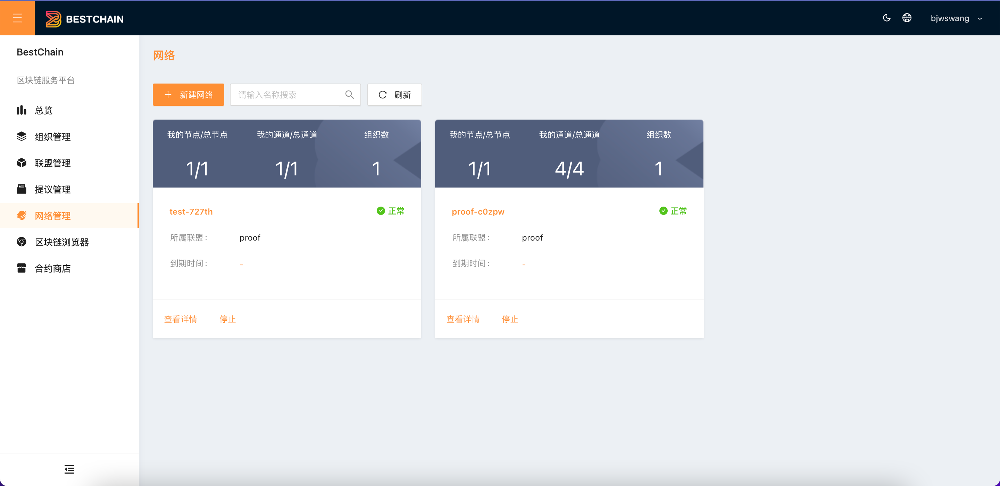
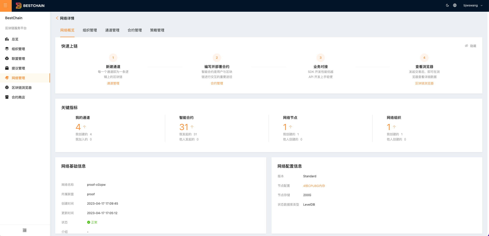
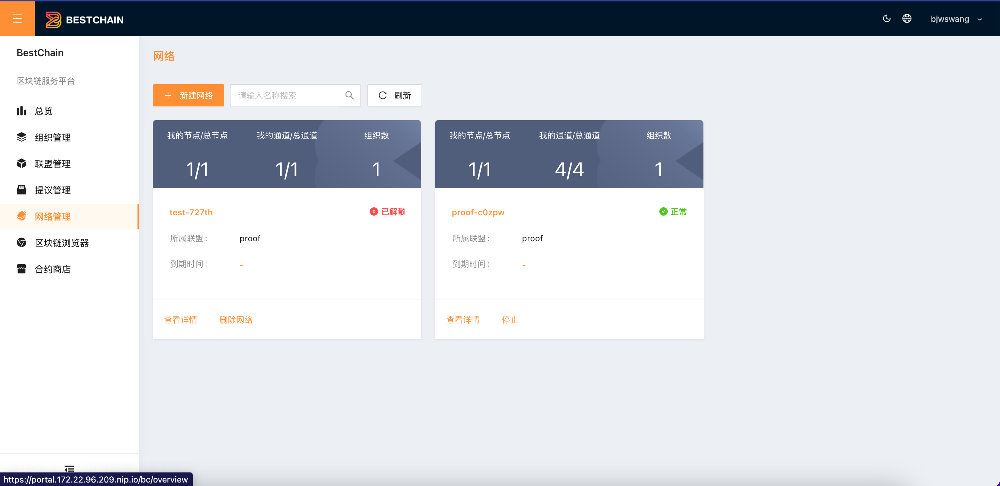

## 新建网络

:::tip
参见[**快速入门-创建网络**](./)
:::

## 查看网络列表

单击左侧导航栏中的**网络管理**，进入网络列表页面。如下图所示：

* **网络名称：**显示网络名称。
* **状态：“停止”**网络停止；**“运行中”**网络正常运行；
* **所属联盟：**网络所属的联盟。
* **到期时间：**网络到期时间，精确到秒。下方提示到期倒计时
* **我的节点/总节点：**用户的在网络中的节点数/网络总节点数。
* **我的通道/总通道：**用户的在网络中的通道数/网络总通道数。

## 查看网络详情

选择网络，点击**详情**，可进入网络详情页面。如下图所示：

详情页面包含:

* **快速上链引导**
  * 点击「**通道管理**」，切换通道管理列表。
  * 点击「**合约管理**」，切换合约管理列表。
  * 点击「**区块链浏览器**」，跳转区块链浏览器页面。

* **关键指标**
  * **我的通道**：用户的在网络中的通道数。
  * **智能合约**：网络中的部署的智能合约数。
  * **网络节点**：网络中所有节点数
  * **网络组织**：网络中所有组织数（继承联盟）

## 停止网络

网络不允许直接删除，必须先**停止网络**。点击**停止**后，会发起提议，提议通过后，网络状态会变为**已解散**

## 删除网络

网络停止后，网络的创建者可以选择**删除网络**

:::tip
删除网络后，网络内的所有数据都会被清除，不可恢复，请谨慎操作。
:::

