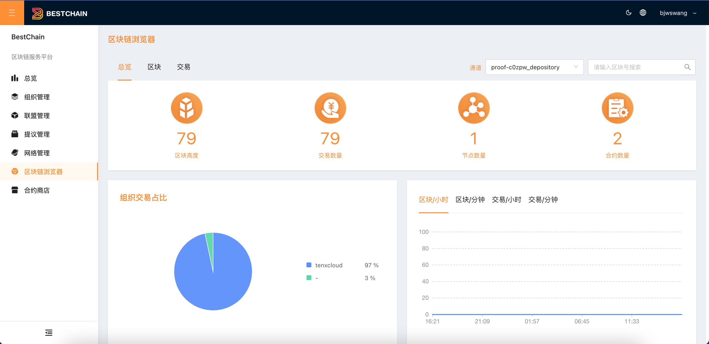

本文档介绍如何通过控制台使用区块链浏览器查看链上数据。

## 查看总览

单击左侧导航栏中「**区块链浏览器」**，进入区块链浏览器页面。选择**通道，**如下图所示：

参数说明：

- **网络通道主要指标**
  - **区块高度:** 通道的区块高度
  - **交易数量:** 通道内的交易总数
  - **节点数量:** 通道内的节点总数
  - **合约数量：**通道内的合约总数
- **组织交易占比:**通道内各组织发起交易的数量占比
- **单位时间出块和交易的趋势:** 每小时，每分钟出块和交易的数量及趋势
- **最新交易/区块:** 最新交易及出块情况。

## 查看区块

## 查看交易

