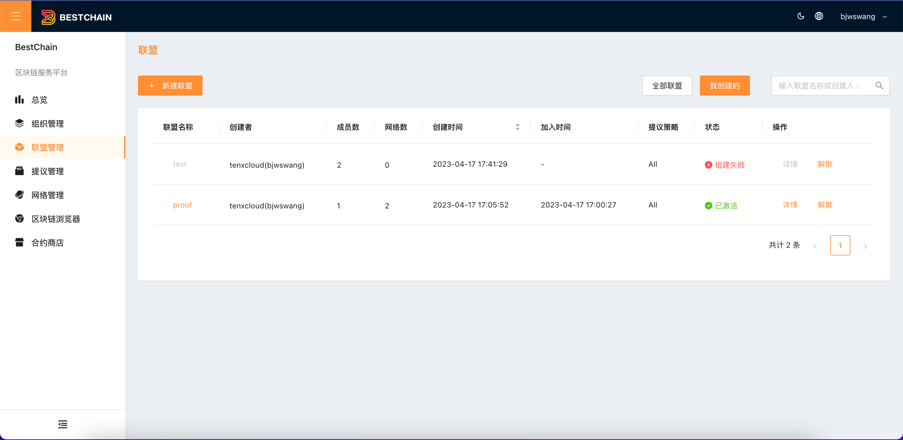
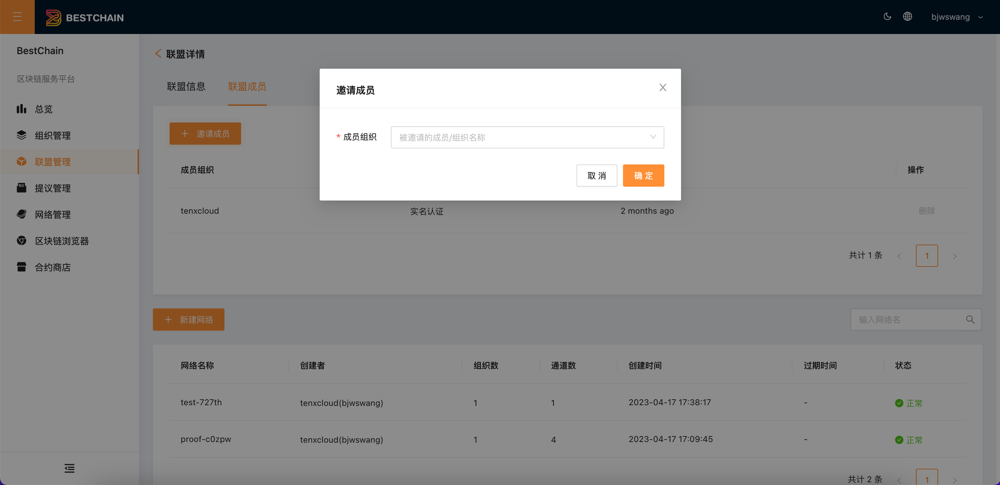
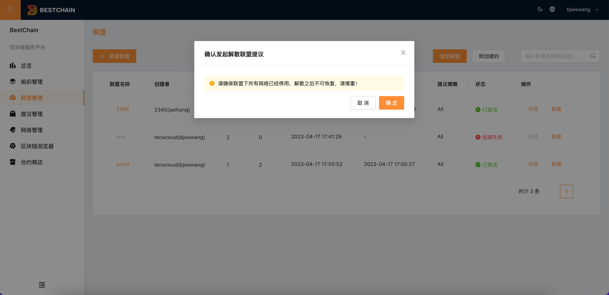
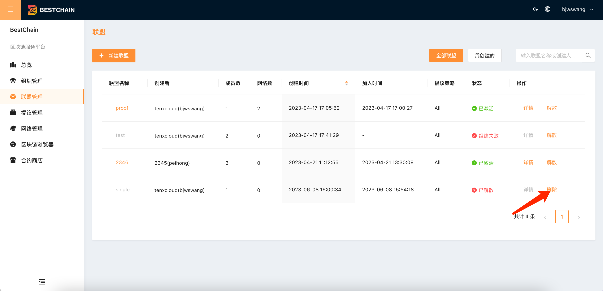

本文档介绍如何通过控制台进行查看联盟、管理联盟。

## 新建联盟

参见[**快速入门-创建联盟**](../QuickStart/usage.md#步骤二创建联盟)

## 查看联盟

1. 单击左侧导航栏中的**联盟管理**，进入联盟列表页面。如下图所示：

2. 点击**联盟名称**或者**详情**进入**联盟详情**页面。

在**联盟详情**页面中，可查看该联盟的基本信息和联盟下的区块链网络信息，单击**新建网络**可创建区块链网络（参见快速入门「**创建联盟**」）。如下图所示：

在**联盟详情**页面中，点击**联盟成员，**可以看到联盟下的组织成员，可以点击**邀请成员**邀请平台其他组织加入联盟。也可**删除**联盟成员组织，新增和删除都需要发起提议投票。如下图所示：

## 解散联盟

1. 选择左侧导航栏中的**联盟**。

2. 在“联盟”列表页面中，选择**解散**联盟。当联盟解散成功后，联盟发起者可以删除联盟。如下图所示：

## 删除联盟

:::tip
联盟解散后，方可删除联盟。
:::tip

