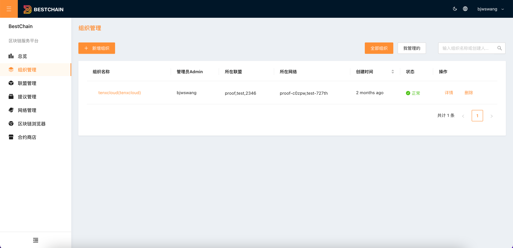
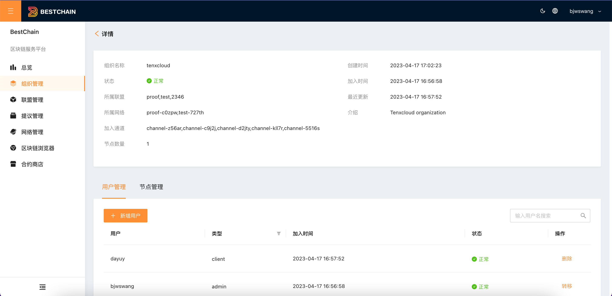
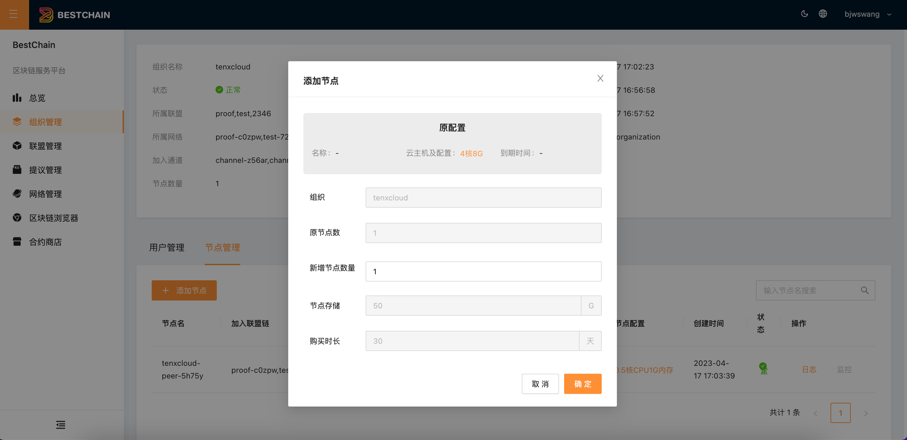
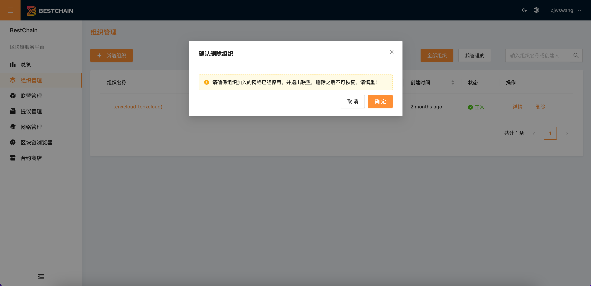

本文档介绍如何通过控制台进行查看组织、新建组织、删除组织、邀请成员。

## 查看组织

1. 单击左侧导航栏中「**组织管理」**，进入联盟列表页面。如下图所示：

2. 单击组织的名称或「**查看详情」**，进入“组织详情”页面。可查看该组织的基本信息和组织下的用户和节点信息，如下图所示":

3. 组织用户管理，选择用户管理页签，可查看该组织的成员信息和待加入成员信息，单击新增用户可邀请成员加入组织，被邀请成员需要是平台注册用户。如下图所示：

4. 组织节点管理，选择**节点管理**页签，可查看该组织下的节点信息，单击**添加节点**可添加更多节点资源。如下图所示：

## 删除组织

当组织不在任何网络和联盟里，点击「**删除组织**」，可以删除组织。

## 新增组织

参见 **快速入门**中 [**创建组织**](../QuickStart/usage.md#步骤一创建组织)。
