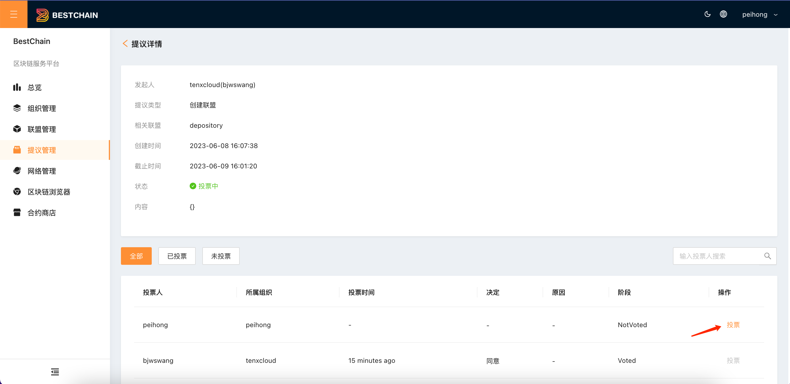
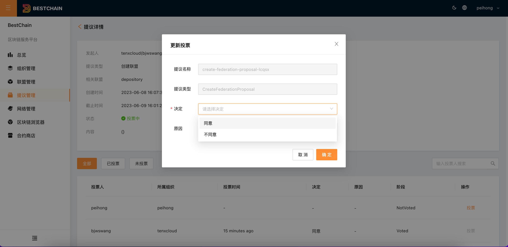

本文主要介绍控制台各种投票提议的操作。

## 操作步骤

### 查看提议

单击左侧导航栏中的**提议管理**，进入提议列表页面。如下图所示：

### 查看提议详情

选择一个状态为**NotVoted**的提议，点击**详情**，进入提议详情页面。如下图所示：

### 提议投票

页面会展示所有相关组织用户当前的投票状态，用户可选择自己代表的组织完成投票。如下图所示：

## 提议类型详解

主要包括以下几类提议：

- **邀请用户加入组织**
- **创建联盟**
- **邀请组织加入联盟**
- **联盟驱逐组织**
- **解散联盟**
- **停止网络**
- **邀请组织加入通道**
- **合约部署**
